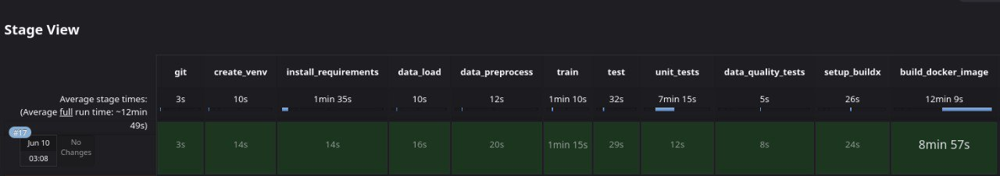

**Требования к реализации проекта**:

1. Исходные коды проекта должны находиться в репозитории GitHub.
  
2. Проект оркестируется с помощью ci/cd (jenkins или gitlab).

3. Датасеты версионируются с помощью dvc и синхронизируются с удалённым хранилищем.

4. Разработка возможностей приложения должна проводиться в отдельных ветках, наборы фичей и версии данных тоже.

5. В коневеере запускаются не только модульные тесты, но и проверка тестами на качество данных.

6. Итоговое приложение реализуется в виде образа docker. Сборка образа происходит в конвеере.

7. В проекте может использоваться предварительно обученная модель. Обучать собственную модель не требуется.

В ходе выполнения проекта была произведена проверка тестов на Jenkins. Ниже приведен скриншот, иллюстрирующий стадии выполнения конвейера и время, затраченное на каждую из них.

На GitHub Actions не проходит PyTest, т.к. модель, необходимая для тестов, не была предварительно дообучена и сохранена. Однако на Jenkins всё хорошо.

Также, у нас есть Streamlit-приложение, которое принимает текстовый ввод пользователя, обрабатывает его с помощью предварительно обученной модели "fine-tuned-emotion-model" из библиотеки HuggingFace Transformers для классификации эмоций, и выводит предсказанную эмоцию на экран.

Присутствует и FastAPI-приложение, которое принимает текстовый ввод пользователя через POST-запрос, обрабатывает его с помощью предварительно обученной модели "fine-tuned-emotion-model" из библиотеки HuggingFace Transformers для классификации эмоций, и возвращает предсказанную эмоцию в формате JSON.

Ссылка на google диск: https://drive.google.com/drive/folders/1udIM8HBYDx6kCuKu2BJLPDAXH8RfEYY1
